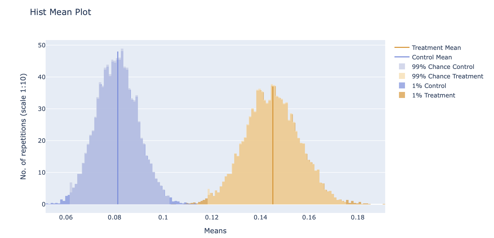
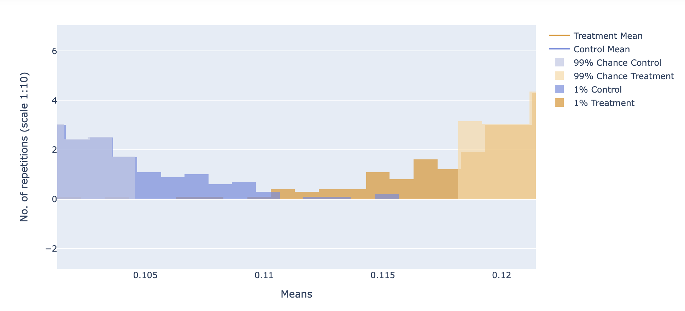

# A/B testing - Page Speed x Conv. Rate

## Motivation

The project's objective is to check the A/B testing in daily usage. At Bloco-b.com, we usually optimize the speed of the client's website, looking for improvements in user experience. The goal of running that A/B test is to evaluate if a change in load speed also improves performance in the conversion rate because we note a significant difference in the conversion rate after the speed improvements in one of our client's website.

## Overview

* Set Up The Experiment and Formulating a Hypothesis
* Designing Experiment
* Random Sampling of the data.  
* Interpreting the results
* Bootstrapping 
* Conclusion

## Resources Used
 **Python Version**: 3.7 
 **Packages**: pandas, statsmodels, math, scipy, plotly

## Data  
Here we will use the data extracted from google analytics for a determined period on our client's website. Each line represents a session, and we have three columns. 

* Client_ID - Represent the unique user
* Conversion -  Where 0 represents the sessions that do not convert
* Group - Tha contains two values, Control and Treatment groups. That means users that came before and after the changes, respectively.  
 
## Designing Experiment

Since the difference in conversion rates between the two groups is 0.066, and the treatment group is greater than the control group's mean, we would like to check if this result is statistically significant.

So we have the Null Hypothesis

##### Hₒ: p = pₒ

##### Hₐ: p > pₒ

Where p and pₒ stand for the conversion rate of the new and old websites, respectively, we'll also set a confidence level of 99%:

##### α = 0.01

Since our α=0.01 (indicating 1% probability), our confidence (1 — α) is 99%

### Choosing a sample size

To estimate the sample size, we need to consider Power analysis, and it depends on a few factors:

- **Power of the test (1 — β)** — The ability to detect a difference between groups when a difference exists. Power is 1-β, where β is the risk of a type-II error (false-negative rate). This is usually set at 0.8 by convention. We will fix it as 0.9 power (β of 0.1-0.1).
- **Alpha value (α)** — The critical value we set earlier to 0.01
- **Effect size** — How big of a difference do we expect between the conversion rates. Here we are going to consider a 0.05 increase. Since the baseline is 0.07 we will expect at least Conv. rate of 0.12 in the treatment group 

##  Interpreting the Results

z-scores: -4.50
p-value: 0.0000067659

The very, very low z-scores, associated with very small p-values, are found in the tails of the normal distribution.

**Since the half p-value is lower than our alpha (3e-06) so we can reject the Hₒ with 99% of confidence.**

**The conversion rate after the load time improvement is different from the previous conversion rate!**

It is very unlikely (with small probability) that the observed conversion rate is the result of random processes, so we can reject the null hypothesis. That the website performs the same conversion rate after the page speed improvements. 

## Bootstrapping
With Bootstrap, we resample the original sample with the same sample size and replacement for many iterations.

It is a powerful tool that allows us to make inferences about the population statistics (e.g., mean, variance) when we only have a finite number of samples. Wich is our case since we are estimating website traffic conversion rate with a limited sample.

After 10K iterations, it seems that the bootstrapped conversion rate means changed for both of the groups. We can also note an intersection between the two groups since the max value of Conv. rate presented for the control is larger than the min Conv. rate value shown for the treatment group in this experiment. 

## Conclusion

Here we use statistical methods in a real-world experiment. 
We reject the hypothesis's assumption that the conversion rate incremented after the speed change happened by a pure chance. 

We check that even with a small sample of users, our groups were statistically significant. Even if it was not, python + stats allow us to use technics as bootstrapping to re-sample and repeat our experiment multiple times.

We have the power to evaluate how confident we are in our affirmations. Hypotesis testing is the only method to prove that something is true or not. Hypotesis testing is a fantast tremendous subject. 

Author: Erick C. Varela  
Date: 01/05/2022
